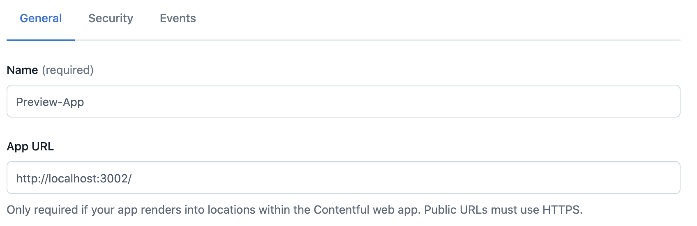
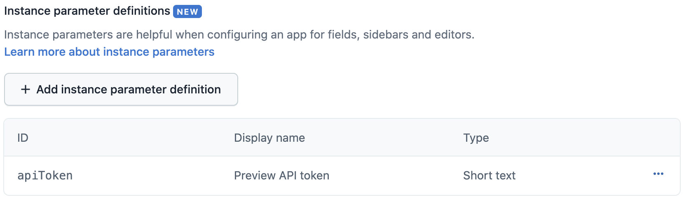
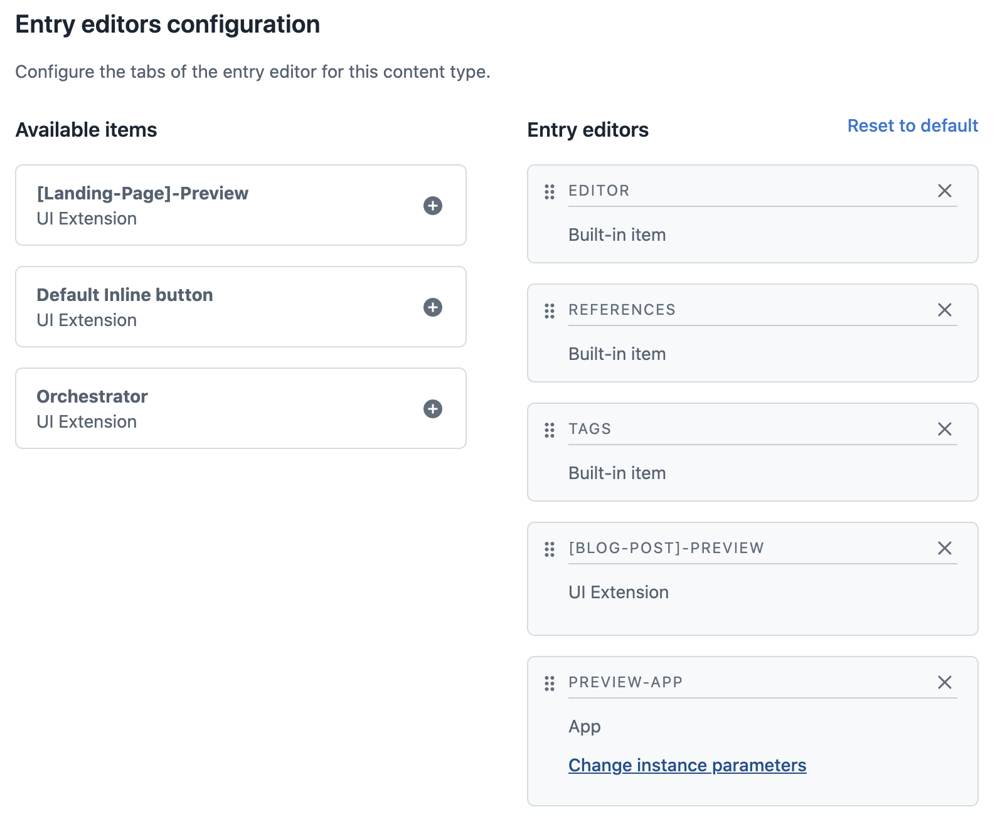
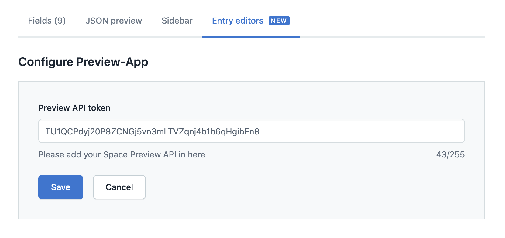

# JSON Preview

The JSON Preview App provides a JSON preview of the entry fields whichh will be available within the web app as Entry Editor Tab or Field Button.

Locations:

-   Entry Editor
-   Field
-   Dialog 

# Installation

## Step 1 General Details

You can choose the name of your app and add the url to your app domain.



## Step 2 Location

This app was build to be installed on the field level and entry editor, however, feel free to adapt it for other fields.


## Step 3 Parameters

Add an instance parameter called "apiToken" as definition.



## Step 4 Activate App

After isntalling the app, you can activate the app as a field view, or a Entry Editor tab as per below screenshot. Please make sure to ass your preview API token as your parameter.




<<<<<<< HEAD
=======
```
>>>>>>> 777b166851dc28d5ffa8ab9c2852c5ba4e22a4e1

## For Developers: Running This App Locally

> This project was bootstrapped with [Create Contentful App](https://github.com/contentful/create-contentful-app).

Before running the app locally, you will need to do 2 things:
* Ensure your Contentful user is admin or developer for the organization.
* Create an [`AppDefinition`](https://www.contentful.com/developers/docs/extensibility/app-framework/app-definition/)
in your organization with the following properties:
    * The App URL: http://localhost:3000
    * An entry field location with a type of JSON Object
    * An instance parameter of type short text with the id `valueName`

Once your app definition is created, running `npm start` will start a local server on
port 3000 (http://localhost:3000).

You must create or modify a content type which has a JSON field in order to see the app
inside of the Contentful web app.

## Learn More

[Read more](https://www.contentful.com/developers/docs/extensibility/app-framework/create-contentful-app/) and check out the video on how to use the CLI.

Create Contentful App uses [Create React App](https://create-react-app.dev/). You can learn more in the [Create React App documentation](https://facebook.github.io/create-react-app/docs/getting-started) and how to further customize your app.
